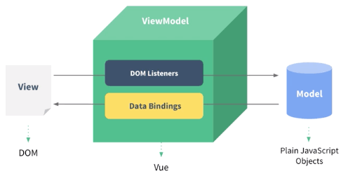

# Hello_World

1. 引入 `Vue.js`
  - ``
2. 创建 `Vue` 对象 
  - （`new Vue`）
  - `el`: 指定根element(选择器)
  - `data`: 初始化数据（页面可以访问）
3. 双向数据绑定：`v-model`
4. 显示数据：`{{xxx}}`
5. 理解`vue`的`mvvm`实现

首先有一个`input`监听，一旦改变input值就把内存的`data`数据做出相应改变

关键词：`DOM监听`、`数据绑定`